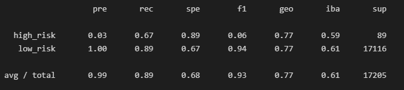

# Module 18 Challenge
### Miguel Fidelino

## Overview of the analysis
Using imbalanced-learn and scikit-learn libraries, we are to build and evaluate models to predict credit rating using resampling: oversalmple using RandomOverSampler and SMOTE, undersample using ClusterCentroids, and using a combination of the two latter samplers using SMOTEENN. 

## Results

Below are the balanced accuracy score and the precision and recall scores of all six machine learning models

* Random Over Sampler

* Snthetic Minority Over Sampling Technique (SMOTE)

* ClusterCentroids

* SMOTE + Edited Nearest Neighbours (SMOTEENN)

* Balanced Random Forest Classifier

* Easy Ensemble Classifier

## Summary
