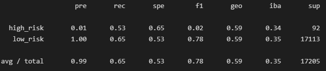
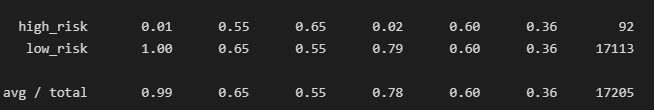
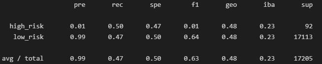

# Module 18 Challenge
### Miguel Fidelino

## Overview of the analysis
Using imbalanced-learn and scikit-learn libraries, we are to build and evaluate models to predict credit rating using resampling: oversalmple using RandomOverSampler and SMOTE, undersample using ClusterCentroids, and using a combination of the two latter samplers using SMOTEENN. 

## Results

Below are the balanced accuracy score (rounding to the nearest hundredth) and the precision and recall scores of all six machine learning models

* Random Over Sampler
Balanced Accuracy Score: 59% 

* Snthetic Minority Over Sampling Technique (SMOTE)
Balanced Accuracy Score: 60%

* ClusterCentroids
Balanced Accuracy Score: 48%

* SMOTE + Edited Nearest Neighbours (SMOTEENN)
Balanced Accuracy Score: 61%

* Balanced Random Forest Classifier
Balanced Accuracy Score: 76%

* Easy Ensemble Classifier
Balanced Accuracy Score: 89%

## Summary

The Easy Ensemble Classifier is perhaps the best model to use, as it provides the highest possible f1 summary score. Most importantly, the Easy Ensemble Classifier can detect high risk scores relatively better than the rest of the models produced.

However, I would not use any of these classifiers as the precision is very poor, with Easy Ensemble Classifier being the highest with 7% precision, and 90% recall.